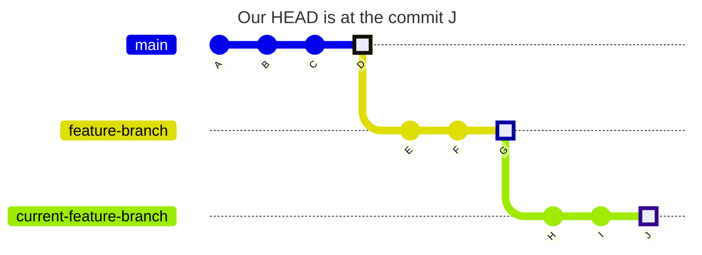
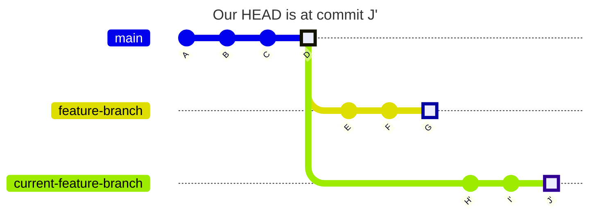

This command is really handy when we accident commit to wrong branch and want to change the parent branch by using `git rebase --onto`

Our current branches tree



and what we would like to achieve:



To replace parent branch with `main`, we need to be on `current-feature-branch` branch and do
```
git rebase --onto main feature-branch
```

For general
```
git rebase --onto new-parent old-parent
```